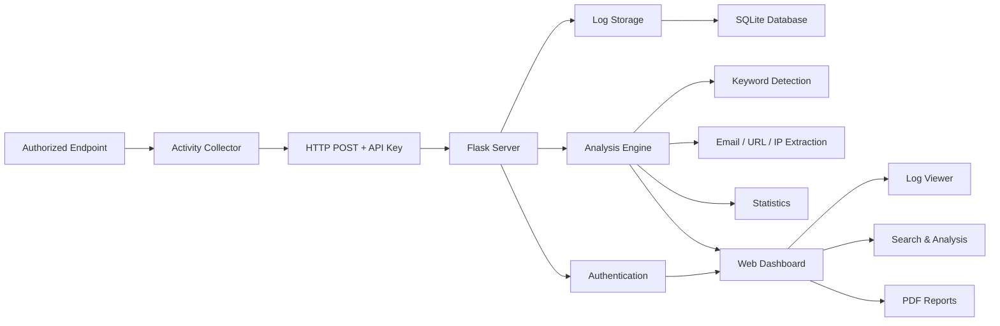
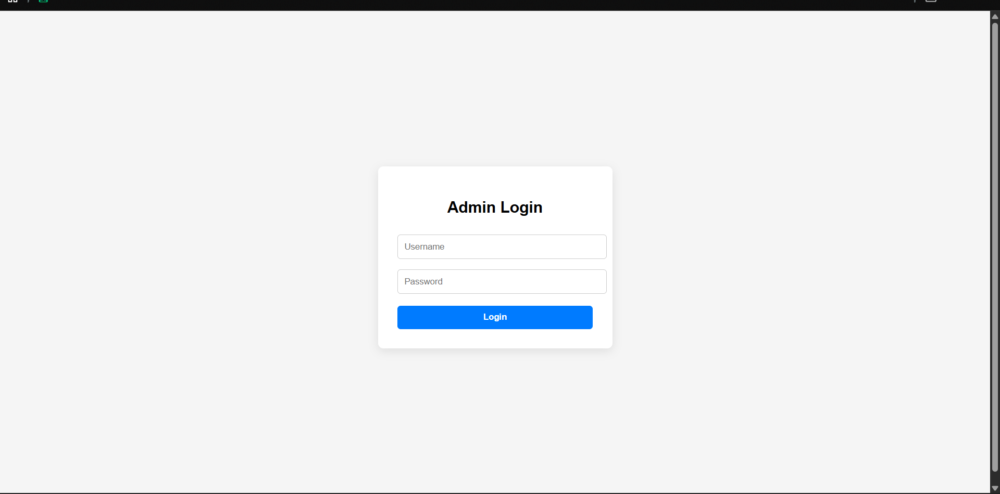
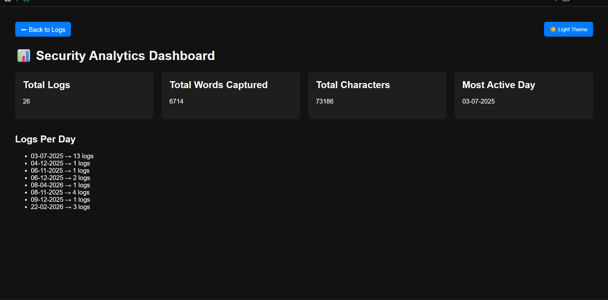
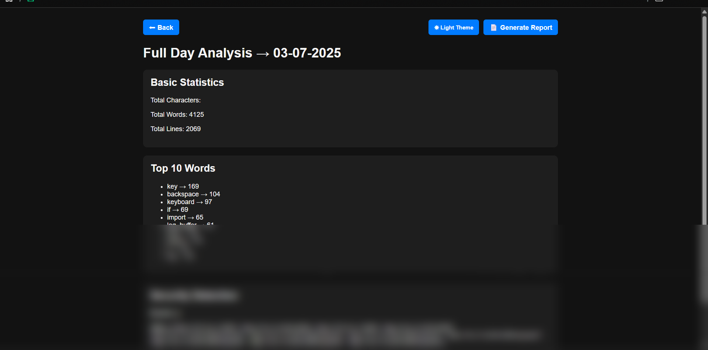
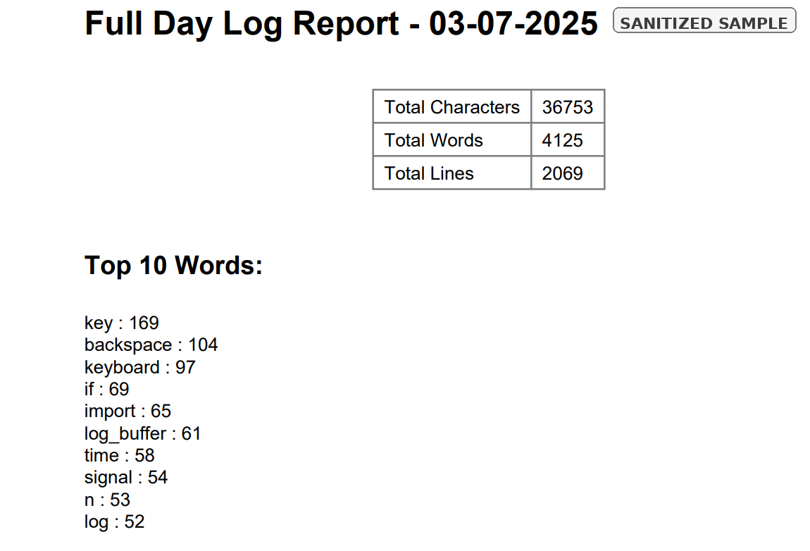

# 🔐 Secure Keylogger-Based Log Monitoring and Analysis System

> A Python-based cybersecurity research project for authorized endpoint monitoring, centralized log management, security-focused analysis, and web-based visualization.

[](https://www.python.org/)
[](https://flask.palletsprojects.com/)
[](https://www.sqlite.org/)
[]()
[](LICENSE)

---

## 🧭 Overview

The **Secure Keylogger-Based Log Monitoring and Analysis System** is a Python-based cybersecurity project developed to explore how endpoint activity can be collected, transmitted, organized, analyzed, and presented through a centralized web interface.

The project combines:

- 🔎 Endpoint activity collection
- 🌐 HTTP-based log transmission
- 🔐 API authentication
- 🗂️ Centralized log management
- 🧠 Security-focused log analysis
- 📊 Web-based monitoring
- 📄 Automated PDF reporting
- 🔑 Environment-based secret management

The system was developed as a **controlled cybersecurity research and educational project**.

> ⚠️ **Important:** This project must only be used on systems where explicit authorization has been provided. It must never be used for unauthorized monitoring, credential collection, or surveillance.

---

## 🎯 Project Objectives

The main goals of the project are to understand and implement practical cybersecurity concepts such as:

- Endpoint activity monitoring
- Centralized security logging
- REST-style API communication
- Authentication and session management
- Security-focused log analysis
- Indicator extraction
- Web-based security dashboards
- Automated security reporting
- Secure configuration management
- Git/GitHub security practices

---

## 🏗️ System Architecture



---

## ✨ Key Features

### ⌨️ Endpoint Activity Collection

The endpoint component provides controlled activity collection for security research.

Features include:

- Real-time keyboard event collection
- Clipboard activity monitoring
- Temporary log buffering
- Periodic log transmission
- Controlled log transmission during process termination
- Communication with a configured Flask server

---

### 🌐 Centralized Log Management

Collected data can be transferred to a centralized Flask server.

The server provides:

- HTTP API for log submission
- API-key authentication
- Date-based log organization
- Time-based log organization
- Centralized server-side storage
- Log browsing and retrieval

---

### 🧠 Security-Focused Log Analysis

The analysis engine transforms raw log information into structured security-oriented data.

The system analyzes:

- Character counts
- Word counts
- Line counts
- Frequently occurring words
- Email addresses
- URLs
- IP addresses
- Potentially sensitive keywords

Current keyword indicators include:

- password
- login
- otp
- bank
- credit
- cvv
- pin
- account
- username

These indicators are intended for **controlled security-analysis demonstrations**, not unauthorized credential collection.

---

### 📊 Web Security Dashboard

The Flask dashboard provides a centralized interface for working with collected logs.

Capabilities include:

- 🔑 User authentication
- 📁 Log browsing
- 🔎 Log searching
- 📄 Log viewing
- 📊 Individual log analysis
- 📅 Daily log analysis
- 🗑️ Authorized log deletion
- 🔐 Password management
- 📈 Dashboard statistics
- 📑 PDF report generation

---

### 🔒 Security Controls

The project includes several security-focused implementation practices:

- Environment-based secret management
- `.env` exclusion from Git
- API-key authentication
- Password hashing
- Failed-login lockout
- Path validation for file operations
- Separation of runtime data from source code
- Sanitization of repository content before publication

---

## 📸 Screenshots

### 🔐 Admin Login



### 📊 Security Analytics Dashboard



### 🔎 Log Analysis



### 📄 Automated Security Report



> **Note:** Screenshots use sanitized sample data for portfolio demonstration. No real credentials, captured keystrokes, or sensitive user information are included.

---

## 🛠️ Technology Stack

| Technology | Role |
|---|---|
| 🐍 Python | Core application development |
| 🌐 Flask | Web server and dashboard |
| 🗄️ SQLite | Authentication and database storage |
| 📡 Requests | HTTP communication |
| ⌨️ Pynput | Keyboard event collection |
| 📋 Pyperclip | Clipboard monitoring |
| 🔐 python-dotenv | Environment-based configuration |
| 📄 ReportLab | PDF report generation |

---

## 📁 Project Structure

```text
.
├── analysis_engine.py
├── keylogger.py
├── server.py
├── requirements.txt
├── .env.example
├── .gitignore
├── LICENSE
└── templates/
    ├── analysis.html
    ├── change_password.html
    ├── dashboard.html
    └── login.html

Runtime-generated logs, databases, reports, and temporary files
are intentionally excluded from version control.
```

---

## 🚀 Getting Started

### 1️⃣ Clone the Repository

git clone https://github.com/dheeraj05-22/SMART-KEY-LOGGER-WITH-REMOTE-ACCESS-ENCRYPTED-USING-PYTHON.git

cd SMART-KEY-LOGGER-WITH-REMOTE-ACCESS-ENCRYPTED-USING-PYTHON

### 2️⃣ Create a Virtual Environment

#### Windows

python -m venv .venv

.venv\Scripts\Activate.ps1

#### Linux

python3 -m venv .venv

source .venv/bin/activate

### 3️⃣ Install Dependencies

pip install -r requirements.txt

---

## ⚙️ Configuration

The project uses environment variables instead of storing sensitive credentials directly in the source code.

Create a `.env` file in the project root using `.env.example` as a template.

Required variables:

API_KEY=your-api-key
FLASK_SECRET_KEY=your-flask-secret-key
ADMIN_PASSWORD=your-admin-password

The `.env` file is intentionally excluded from Git.

> 🔒 Never commit real API keys, passwords, captured logs, databases, or other sensitive information to a public repository.

---

## ▶️ Running the Server

Start the Flask server:

python server.py

The application runs locally at:

http://127.0.0.1:5000

The server provides the dashboard, authentication system, log-management functions, analysis functions, and reporting functionality.

---

## 💻 Running the Endpoint Collector

Open a separate terminal and run:

python keylogger.py

The collector communicates with the configured Flask server using the API key stored in the environment configuration.

> 🧪 For testing, use a dedicated virtual machine or other authorized laboratory environment with synthetic data.

---

## 🔍 Log Analysis Workflow

The analysis workflow can be summarized as:

Raw Endpoint Activity
        ↓
Buffered Log Data
        ↓
HTTP Transmission
        ↓
Centralized Server Storage
        ↓
Analysis Engine
        ↓
Indicator Extraction
        ↓
Dashboard Visualization
        ↓
PDF Security Report

This workflow demonstrates the basic transformation of raw endpoint activity into information that can be reviewed during security analysis.

---

## 🧪 Recommended Testing Environment

Because this project handles keyboard and clipboard activity, testing should be performed in an isolated environment.

Recommended setup:

- 🖥️ Dedicated test machine or virtual machine
- 🔐 Synthetic credentials
- 🧪 Test-only data
- 🌐 Localhost or isolated network
- 🚫 No real personal credentials
- 🚫 No real banking information
- 🚫 No unauthorized endpoints

This keeps the project suitable for cybersecurity education and controlled experimentation.

---

## 🔐 Git & Repository Security

The repository excludes sensitive and generated files through `.gitignore`.

Examples include:

.env
logs/
server_logs/
reports/
database.db
*.txt
*.pdf
__pycache__/
*.pyc
.venv/
venv/

A safe `.env.example` file is included so that users can understand the required configuration without exposing actual secrets.

---

## ⚠️ Ethical & Legal Disclaimer

This project is intended strictly for:

- Cybersecurity education
- Authorized security research
- Controlled laboratory testing
- Security monitoring experimentation
- Log-analysis research

Do not use this software to monitor systems, devices, accounts, networks, or individuals without explicit authorization.

Keyboard and clipboard data can contain highly sensitive information. Testing should therefore use isolated environments and synthetic data whenever possible.

The author is not responsible for misuse of this software.

---

## 📚 Learning Outcomes

This project provided practical experience with:

- 🐍 Python cybersecurity programming
- 🌐 Flask web application development
- 📡 REST-style API communication
- ⌨️ Endpoint activity monitoring
- 🗂️ Log collection and management
- 🧠 Security-oriented text analysis
- 🔑 Authentication and session management
- 🔐 Password hashing
- 🗄️ SQLite database handling
- 🔒 Environment-based secret management
- 📄 PDF report generation
- 🌱 Git/GitHub security practices

---

## 🎓 Cybersecurity Relevance

This project demonstrates practical exposure to several areas relevant to cybersecurity roles and further academic study:

**Endpoint Security**
→ Activity collection and endpoint monitoring

**Security Monitoring**
→ Centralized log collection and dashboard-based review

**Detection & Analysis**
→ Keyword detection and indicator extraction

**Web Security**
→ Authentication, sessions, API authentication, and access controls

**Security Engineering**
→ Secure configuration and secret management

**Security Reporting**
→ Automated analysis and PDF report generation

---

## 👨‍💻 Author

### Dheeraj Poreddy

Computer Science Engineering graduate specializing in Cybersecurity.

Interested in:

- 🛡️ Security Operations
- 🔎 Threat Detection
- 📊 Security Monitoring
- 🌐 Network Security
- ☁️ Cloud Security
- 🧪 Cybersecurity Research

---

⭐ If you find this project useful for cybersecurity learning or research, feel free to explore the repository and its implementation.

> Built as a cybersecurity learning project with a focus on practical security monitoring, log analysis, and secure software practices.